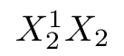
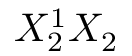

# Even subscript height

Other things being equal, TeX will aim to position subscripts and
superscripts in places that ''look good''.  Unfortunately, it only
does this for the sub- and superscripts of each atom at a time, so if
you have
```latex
$ X^{1}_{2} X_{2} $
```
the second subscript will appear higher, since the first has moved
down to avoid the superscript;
the effect can be noticeably distracting:
  

You can avoid the problem, for a single instance, by
```latex
$ X^{1}_{2} X^{}_{2} $
```
here, the dummy superscript has the requisite ''pushing down'' effect:
  

While this technique does what is necessary, it is tedious and
potentially error-prone.  So, for more than one or two equations
in a document, the LaTeX user is advised to use the
[`subdepth`](http://ctan.org/pkg/subdepth) package, which forces the lower position for all
subscripts.

